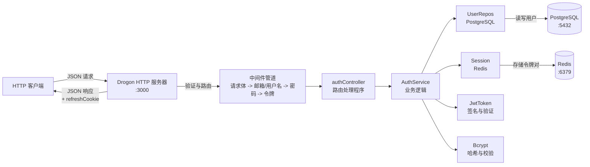
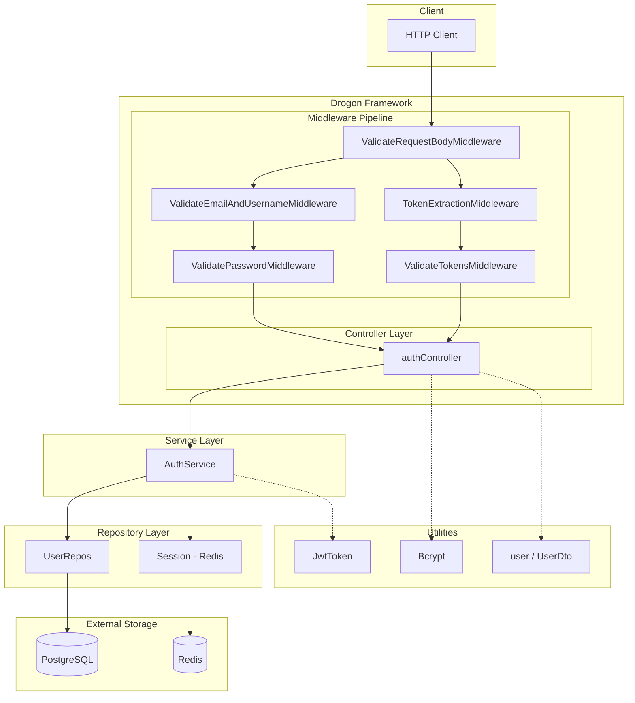
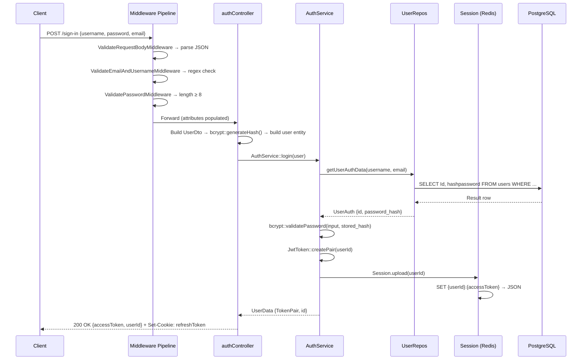
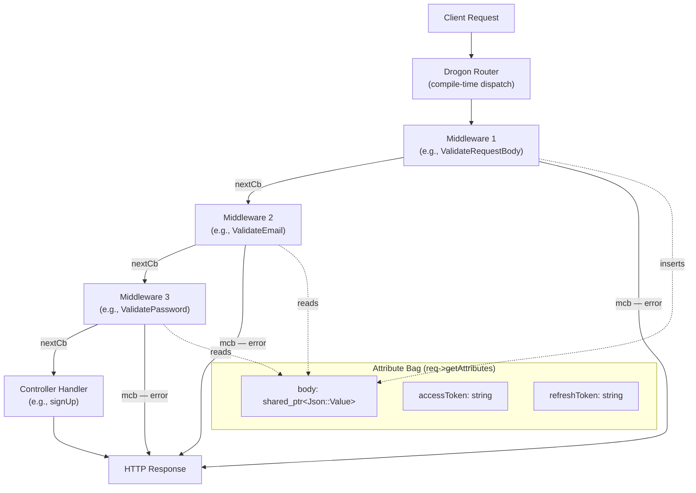

## 依赖安装
```bash
git submodule update --init --recursive
```

或者
```bash
./dependencies.sh
```

## 启动容器
### 没有其他postgres容器在运行
```bash
sudo docker-compose -f /home/l/drogon_dev/drogon-auth/docker-compose.yml up -d postgres
```
- 加入网络
>如果不是使用drogonframework/drogon镜像启动容器开发则不需要加入网络 my-net
> 请确保已创建网络 my-net
> 否则，使用以下命令创建网络：
> `sudo docker network create my-net`

```bash
sudo docker network connect my-net postgres_container_compose_test
```
### 有其他postgres容器在运行
- 登录其他postgres容器
```bash
sudo docker exec -it postgres_prod psql -U postgres -d postgres

```
- 执行sql命令句
```sql
# 查看所有数据库
\list

# 如果没有数据库 postgres 则创建数据库(默认有)
CREATE DATABASE postgres;

# 进入数据库 postgres(默认在)
\c postgres

#执行创建表的sql命令句
# migrations/000_create_schema_migrations.sql
# migrations/001_create_users_table.sql

# 查看所有表
\dt
```

## 健康检查
- 访问健康检查接口
```bash
curl http://localhost:8080/api/v1/health
```

# 项目重要点记录
> [中文完整解释文档](https://zread.ai/capybaracplusplus/drogon-auth)

## 项目结构
```bash
drogon-auth/
├── src/
│   ├── main.cpp                         
│   ├── config.json                       # Drogon 运行时配置(数据库连接、监听端口、线程数)
│   ├── controllers/
│   │   ├── authController.h              # 路由 ↔ 处理函数 ↔ 中间件映射
│   │   └── authController.cpp            # HTTP 处理函数实现（请求解析、响应构建、Cookie 设置）
│   │
│   ├── middlewares/                      # 请求拦截管道
│   │   ├── ValidateRequestBodyMiddleware.hpp # JSON 请求体解析及空值检查
│   │   ├── ValidateEmailAndUsernameMiddleware .hpp # 邮箱正则匹配 + 用户名非空检查
│   │   ├── ValidatePasswordMiddleware .hpp # 密码存在性 + 最小长度（8个字符）检查
│   │   ├── TokenExtractionMiddleware.hpp # 提取 accessToken（请求体）+ refreshToken（Cookie）
│   │   └── ValidateTokensMiddleware.hpp  # JWT 签名验证 + Redis 会话查询
│   │
│   ├── services/
│   │   ├── serviceAuth.hpp               # 认证业务逻辑接口
│   │   └── serviceAuth.cpp               # 注册、登录、注销、令牌刷新
│   │
│   ├── repositories/
│   │   ├── userRepos.hpp / .cpp          # 用户 PostgreSQL CRUD 操作
│   │   └── sessionRepos.hpp / .cpp       # 用于 JWT 令牌对的 Redis 会话存储/检索/删除
│   │
│   ├── models
│   │   └── user.hpp                      # 用户领域模型（username, email, hash）
│   │
│   ├── dto                 
│   │   └── userDtro.hpp                  # 数据传输对象定义
│   │
│   └── utils
│   │   └── jwt
│   │       └──jwtToken.cpp               # JwtToken 类——创建/验证 JWT 令牌对
│   │
├── migrations/
│   ├── 000_create_schema_migrations.sql
│   └── 001_create_users_table.sql        # users 表 (id, username, email, hashpassword)
│   │
├── libs/                                 # 第三方依赖 (jwt-cpp, Bcrypt, redis++, 等)
├── tests
│   └── serviceAuth.cpp                 # 单元测试（当前构建已禁用）
│   │
├── openapi.yaml                          # 所有端点的 OpenAPI 3.0 规范
├── pic/authRefreshToken.png              # 令牌刷新流程图
├── docker-compose.yml                    # 用于开发的 PostgreSQL 容器
└── CMakeLists.txt                        # 构建配置

```

## 架构概览
应用程序遵循 `Controller → Service → Repository` 分层架构。
Drogon 框架通过中间件管道对传入的 HTTP 请求进行验证，然后将其路由到 `authController`，
后者将业务逻辑委托给 `AuthService`。数据持久化分为两部分：PostgreSQL（用户记录）和 
Redis（活跃的会话令牌）。src/config.json 集中管理所有服务的连接参数。


---
|方法	|端点	|是否需要鉴权	|请求体字段	|响应要点|
|--|--|--|--|--|
|POST	|/sign-up	|否	|username, email, password |201 — 注册成功确认|
|POST	|/sign-in	|否	|username, email, password	200 — accessToken, userId, refreshToken Cookie|
|POST	|/changePassword	|是（双令牌）	|accessToken, password	200 — 密码更新确认|
|POST	|/getNewAccessToken	|是（双令牌）	|accessToken, refreshToken	200 — 新的 accessToken，新的 refreshToken Cookie|
|POST	|/logout	|是（双令牌）	|accessToken, refreshToken	200 — 注销成功确认|

---

## 分层架构
三层分层架构——控制器、服务、仓储——并配有一个正交的中间件管道，在请求到达任何控制器处理程序之前对其进行拦截。
每一层都有单一且明确的职责，依赖关系严格自上而下流动。
核心原则是控制器绝不直接与数据库通信——它们将所有业务逻辑委托给 `AuthService`，由后者统筹各个仓储。
这种分离意味着认证策略可以独立于 HTTP 接口进行演进。



## 端到端请求流（以登录为例）
为了将架构落实到具体场景中，以下是 `/sign-in` 请求的完整旅程：



此序列展示了每一层如何恰好贡献一个关注点：中间件验证输入，控制器处理 HTTP 语义（包括对传入密码进行 bcrypt 哈希及构造 Cookie），
服务层执行认证策略，而仓储层则负责在各自的数据存储中进行持久化操作。

## 请求流架构
下图展示了单个请求如何穿越中间件链并到达控制器处理函数。每个中间件既可以调用 nextCb(std::move(mcb)) 将请求转发给下一个中间件，
也可以调用 mcb(resp) 以错误响应直接短路该链路。
